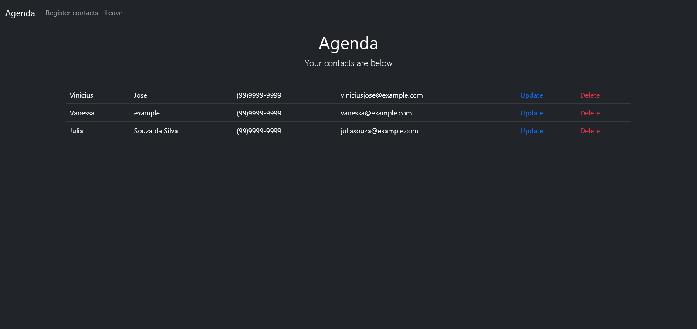

<h1 >
    Project-Agenda
</h1>

<div align="center">
     
</div>

---

<p align="center" target="_blank">
    Made with 💜 by Vinicius Jose
</p>

# Technologies Used
<p>
    This project was developed with the following technologies:
</p>

- Javascript
- Ejs
- Express
- Express-session
- bcryptjs
- connect-flash
- connect-mongo
- validator
- mongoDB
- bootstramp

## 🔥 The Project
<p>
    It is a project of a list of contacts in which you can register and log in, also register contacts with the name, surname, phone or number, either create contacts, update or delete, with error messages to help in the experience, with all information stored in the database.
</p>

# Description
I developed this application in the javascript course of **Luiz Otávio Miranda** from Udemy.

This application was developed in javascript, ejs, express, MongoDB (atlas). I built the following pages within this application: login and signature, homepage of contacts, 404, logged in and register contacts, there are a total of six pages, some using protected routes using middleware with Express session for authentication. MongoDB atlas (mongoose) handles all application data.

I used ejs to compose the front-end of the application, to facilitate the integration of javascript with HTML. The style is all controlled by the bootstramp classes. Error and success messages throughout the application were used through Connect-flash, which facilitated how messages were recorded and deleted after being displayed to the user. I also used bcryptjs to encrypt the user's password and the validator to validate the fields that were filled in by the user.


# Executing the Project

#### Cloning the project

```javascript
    $ git clone https://github.com/zV1N1/project-agenda.git

    # Go into the repository
    $ cd agenda

    # Install dependencies
    $ npm install

    # Run the app
    $ npm start
```

#### Starting the Project

Create an .env file in the root project and add the link to your mongodb atlas bank: 
CONNECTIONSTRING=YOUR_ACONNECTIONSTRING_HERE

```bash
    # Run the app
    $ npm start
```
---

<h4 align="center"> <em>&lt;/&gt;</em> by <a href="https://github.com/zV1N1" target="_blank">zV1N1</a> </h4>
